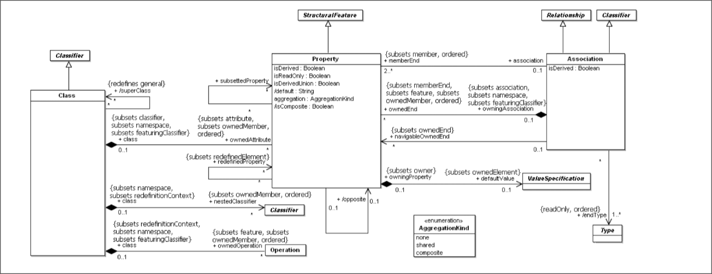
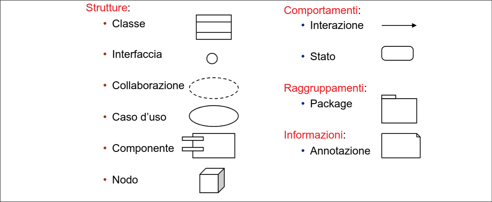
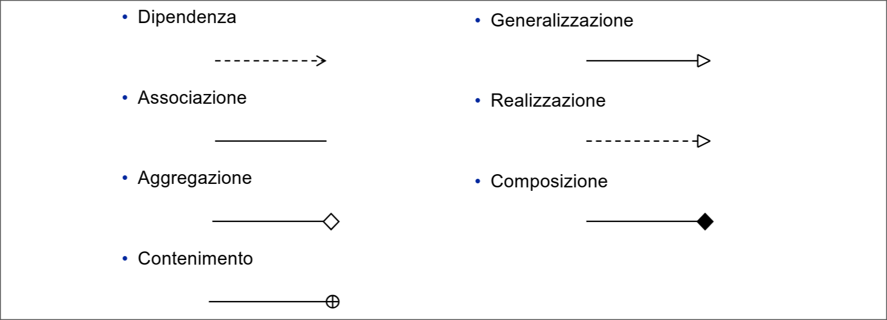

# UML 22/09/2026

UNIFIED MODELING LANGUAGE (ha riunificato tutti i modelli che c'erano prima con la collab tra Booch, Jacobson, Rumbaugh che erano tra i creatori di modelli che vedi a fine del pdf 2).
E' uno standard aperto (a modifiche?).
E' stato standardizzato nel '97.

Esistono dei potenti strumenti CASE che possono creare codice a partire da UML e viceversa.

> [!WARNING]
> UML e' un linguaggio, non un METODO! (come quelli a fine pdf 2)
> Puoi usare un metodo scrivendo con UML.

E' descritto con un metamodello? cioe' UML e' autodefinito con del codice UML.

Uml copre tanti fasi del ciclo di vita del codice.

Un diagramma e' una vista di un modello. Il modello di una nave e' una navi piu' piccola un po' semplificata.
I diagrammi ci fanno vedere un modello da un particolare punto di vista.

Forse per questa parte conviene di piu' stare sul pdf (tante immagini).
Vabbe' per ora ci provo:

## Entita'

Non useremo mai la Collaborazione (godo).

Un componente e' un modulo (tipo una libreria)
Un nodo e' un dispositivo hardware (server, pc, stampante, ...). Un componente puo' essere messo dentro un nodo per dire che il nodo supporta quel software (del componente).

Comunque le vedremo una ad una...

Dentro ad un package posso mettere tanti elementi del modello che sono correlati (classi che svolgono operazioni simili).
Annotazioni molto utili (anche per rappresentare un vincolo non facilmente esprimibile altrimenti in un linguaggio naturale).

## Relazioni

Legano tra loro le entita'

Dipendenza - un entita' A dipende da una B se una modifica in B puo' implicare una modifica in A.
Aggregazione - Part of (debole);
Composizione - Part of (forte);
Realizzazione (NON LA USIAMO NEGLI ESERCIZI)
Contenimento - si usa solo nei diagrammi di package per dire che un package ne contiene degli altri.

## Diagrammi

Sono viste sul modello UML.

### Statici:
* Diagramma delle classi `-` (quelli contrassegnati con questo simbolo possono uscire all'esame)
* Diagramma degli oggetti (compare meno raramente dei diagrammi delle classi)
* Diagramma dei package
* Diagramma dei componenti
* Diagramma di deployment
* Diagramma delle strutture composite

Dinamici:
* Diagramma dei casi d’uso `-`
* Diagramma degli stati `-`
* Diagramma di attività `-`
* Diagramma di interazione
    * Diagramma di sequenza `-`
    * Diagramma di comunicazione
    * Diagramma di sintesi dell’interazione
    * Diagramma dei tempi
