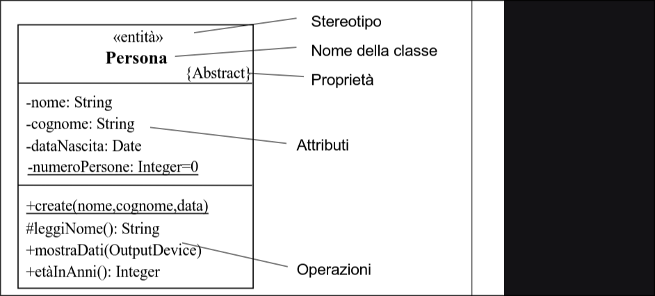
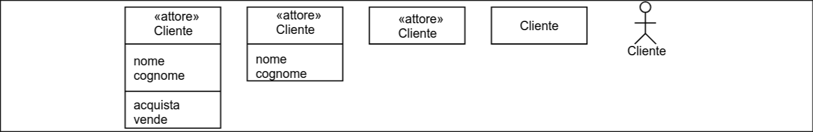
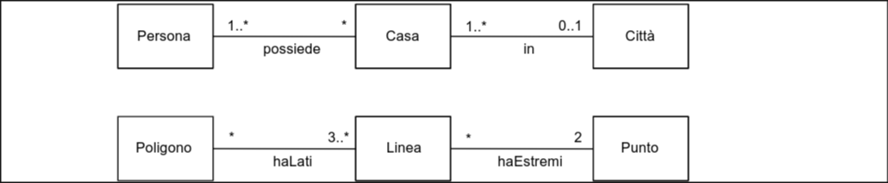
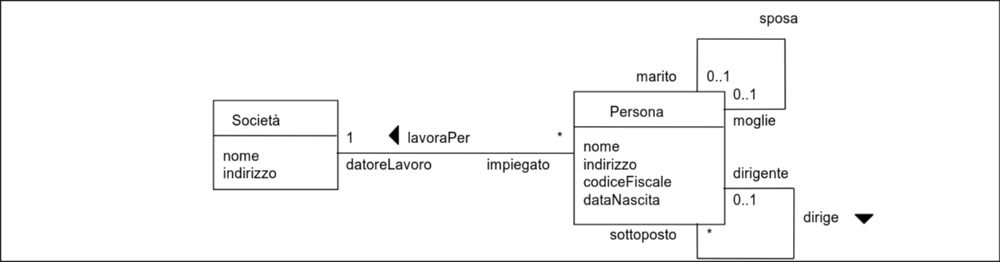
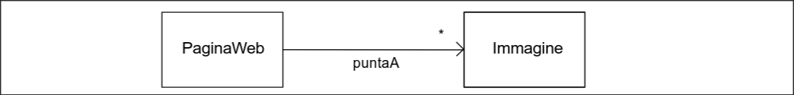
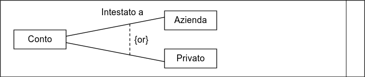
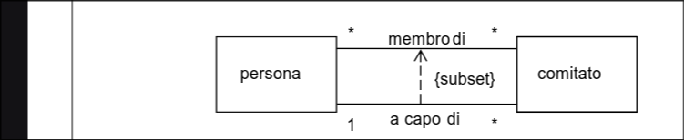
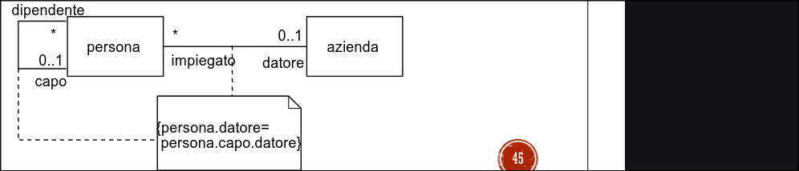
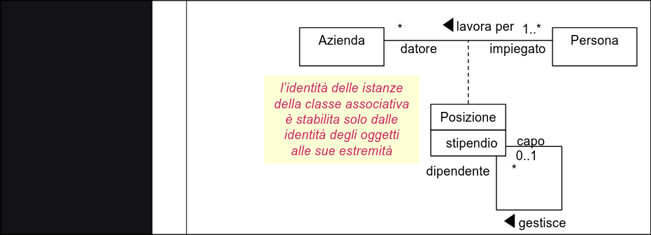

# UML 22/09/2026

UNIFIED MODELING LANGUAGE (ha riunificato tutti i modelli che c'erano prima con la collab tra Booch, Jacobson, Rumbaugh che erano tra i creatori di modelli che vedi a fine del pdf 2).
E' uno standard aperto (a modifiche?).
E' stato standardizzato nel '97.

Esistono dei potenti strumenti CASE che possono creare codice a partire da UML e viceversa.

> [!WARNING]
> UML e' un linguaggio, non un METODO! (come quelli a fine pdf 2)
> Puoi usare un metodo scrivendo con UML.

E' descritto con un metamodello? cioe' UML e' autodefinito con del codice UML.

Uml copre tanti fasi del ciclo di vita del codice.

Un diagramma e' una vista di un modello. Il modello di una nave e' una navi piu' piccola un po' semplificata.
I diagrammi ci fanno vedere un modello da un particolare punto di vista.

Forse per questa parte conviene di piu' stare sul pdf (tante immagini).
Vabbe' per ora ci provo:

## Entita'

Non useremo mai la Collaborazione (godo).

Un componente e' un modulo (tipo una libreria)
Un nodo e' un dispositivo hardware (server, pc, stampante, ...). Un componente puo' essere messo dentro un nodo per dire che il nodo supporta quel software (del componente).

Comunque le vedremo una ad una...

Dentro ad un package posso mettere tanti elementi del modello che sono correlati (classi che svolgono operazioni simili).
Annotazioni molto utili (anche per rappresentare un vincolo non facilmente esprimibile altrimenti in un linguaggio naturale).

## Relazioni

Legano tra loro le entita'

Dipendenza - un entita' A dipende da una B se una modifica in B puo' implicare una modifica in A.
Aggregazione - Part of (debole);
Composizione - Part of (forte);
Realizzazione (NON LA USIAMO NEGLI ESERCIZI)
Contenimento - si usa solo nei diagrammi di package per dire che un package ne contiene degli altri.

## Diagrammi

Sono viste sul modello UML.

### Statici:
* Diagramma delle classi `-` (quelli contrassegnati con questo simbolo possono uscire all'esame)
* Diagramma degli oggetti (compare meno raramente dei diagrammi delle classi)
* Diagramma dei package
* Diagramma dei componenti
* Diagramma di deployment
* Diagramma delle strutture composite

Dinamici:
* Diagramma dei casi d’uso `-`
* Diagramma degli stati `-`
* Diagramma di attività `-`
* Diagramma di interazione
    * Diagramma di sequenza `-`
    * Diagramma di comunicazione
    * Diagramma di sintesi dell’interazione
    * Diagramma dei tempi

# 29/09/2026

# Statici

## Diagramma delle classi

Attraverso questo diagramma si modellano le costituenti fondamentali del nostro sistema.
Classi diagramma di tipo statico.
E' simile all'entity relationship.

### Diagramma degli oggetti

E' una istanza del diagramma delle classi, in effetti non si usa molto ma e' utile per i progettisti per inserire le tuple nel sistema (e' un esempio di come fare).

## Diagramma dei package

Insiemi di classi che collaborano per svolgere una funzionalita' comune

### Diagramma dei componenti

Descrive l'architettura software del sistema

### Diagramma di deployment (schieramento)

Descrive l'architettura hardware del sistema

# Dinamici

## Diagramma dei casi d'uso

Non e' proprio dinamico, elenca le funzionalita' che il sistema puo' svolgere.
Viene creato mettendosi nei panni dell'utente (non di chi progetta il software).

E' il primo diagramma che si disegna quando si inizia la fase di analisi.

## Diagramma degli stati

Facciamo vedere in che modo gli oggetti di una classe reagiscono ad eventi esterni cambiando stato.

## Diagramma di attivita'

Simile al diagramma degli stati. Pero' puo' incorporare anche il diagramma funzionale.
E' perfetto per documentare un workflow.

## Diagrammi di interazione

Sono principalmente funzionali ma c'e' anche una componente dinamica.
Ci fa vedere come gli oggetti interagiscono tra loro scambiandosi messaggi tra loro.
Se A manda un messaggio a B vuol dire che A chiama un metodo di B.

### Diagramma di sequenza

L'unico diagramma di interazione che vedremo.
Enfatizza l'ordine temporale con cui gli oggetti si mandano messaggi.

### Diagramma di comunicazione, ...

Ce ne sono altri di diagrammi di interazione ma non li vedremo.

# Specifiche (p11)

# Ornamenti

Aggiunte che si possono aggiungere alle specifiche (le metteremo senza neanche accorgercene)

# Distinzioni comuni

## Classificatore \ Istanza

(Istanza = oggetto, una specifica cosa; Classificatore = classe, quella cosa in generale)
In uml le Istanze dei classificatori hanno lo stesso nome ma sono sottolineati.

## Interfaccia \ Implementazione

Per un interfaccia devi scrivere `<<interface>>` (e' uno stereotipo).
Ovviamente un interfaccia non ha struttura, non e' istanziabile, e' astratta.
I metodi vanno scritti in corsivo.
Le interfacce possono essere REALIZZATE (freccia tratteggiata vuota)

# MEccanismi di estendibiltia'

## Stereotipo

E' il principale meccanismo di estendibilita' di UML (per estendere le sue funzioni).
Dici praticamente che quell'elemento non e' proprio quello normale del linguaggio ma e' una cosa un po' piu' particolare.
E' una variazione di un elemento di modellazione esistente.
Ce ne sono di predefiniti (tipo <\<interface>>).
Il programmatore puo' introdurne di nuovi.

## Proprieta'

Associa ad un elemento del modello un valore, una stringa.

## Vincoli

Definisce una regola a un elemento del modello
Ad esempio nelle gerarchie ER potrei avere {disjoint, complete}

## Profilo

Un progettista puo' creare un set di stereotipi, proprieta' e vincoli per personalizzare l'UML a piacere.
Esistono dei profili predefiniti standard.

# Architetture

Sono viste diverse che si possono rappresentare sul nostro modello (non molto importante).
Noi lavoreremo sempre a vista dei casi d'uso e vista logica.

FORZA INIZIAMO!

# DIAGRAMMA DEI CASI D'USO

Diagramma funzionale che mostra come gli utenti usano il sistema attraverso casi d'uso (funzionalita').
Gli utenti possono essere altre persone, organizzazioni o anche altri sistemi software.
Comprensibile a chiunque. Infatti serve anche a comunicare con il cliente (non tecnico).
Questo diagramma continua ad essere importante per tutto il ciclo di vita del software. Ad esempio dopo l'implementazione c'e' la fase di test (collaudo) che viene fatta guardando i casi d'uso e si verifica che funzionino. Puo' essere anche usato oer guidare il `rilascio incrementale` del software (a volte il software viene rilasciato a pezzi, "il prossimo mese ti rilascio questi nuovi casi d'uso")

## Attore vs Casi d'uso

Ad esempio per il sistema di Alma esami noi studenti siamo `Attori`.
L'attore scambia informazioni con il sistema, noi ci scriviamo agli appelli e possiamo consultare gli appelli.
L'attore ATTIVA un caso d'uso (iscrizione ad un esame).
L'attore e' sempre una classe, non un oggetto (no istanze).

Il caso d'uso e' sempre attivato da un attore.
Il caso d'uso e' una funzionalita' come percepita da un attore.

Gli omini sono gli autori.
Le linee nere sono dal punto di vista sintattico delle ASSOCIAZIONI. In particolare sono delle ASSOCIAZIONI DI COMUNICAZIONE, l'attore comunica con il caso d'uso.

I casi d'uso sono i cerchi.
L'attore dal punto di vista sintattico e' un

## Relazioni nei diagrammi di casi d'uso

In questi diagrammi si possono anche disegnare relazioni aggiuntive.

* Puo' esserci generalizzazione tra attori (come nelle ER (gerarchie)).
* Le comunicazioni unidirezionali (da non abusare, normalmente sono bidirezionali) si fanno con una freccia ad esempio stampa rapporto
* Generalizzazione tra casi d'uso: Alcune operazioni sono anche altre operazioni (is a).

Le dipendenze vanno quasi sempre stereotipate, cosi' spieghi come viene fatta
Ad esempio Prelievo bancomat si puo' fare solo se fai anche la verifica di identita'. Quando sto prelevando mi viene anche verificata l'identita'. La `<<include>>` serve proprio a questo. Devi immaginarti che nella procedura prelievoBancomat() c'e' anche una chiamata a verificaIdentita().
Per le chiamate opzionali si usa la relazione di dipendenza con stereotipo `<<extend>>`. Significa che il caso d'uso principale non sempre chiama quello che estende. Anche in questo caso si puo' vedere come una chiamata di procedura ma che e' opzionale.
La liberatoria per libri rari e' un'estensione per la richiesta prestito (va letta al contrario).

## Come disegnarli

* Prima identifico i confini del sistema (magari non comprende tutto il dominio)

* Poi si inizia disegnando gli attori.

* Per ogni attore ci si chiede come interagisce col sistema e si disegnano i loro casi d'uso.

Poi ci sarebbero anche queste fasi:

* Noi non lo faremo ma nel mondo reale insieme al diagramma dei casi d'uso bisogna fare anche gli `scenari` che non sono altro che istanze dei casi d'uso. Bisogna documentare gli scenari di successo (vado in banca e prelievo) e di insuccesso (vado in banca, ho dimenticato il documento e non posso prelevare) che fanno fallire il caso d'uso. Questa parte non e' modellata da UML ma esisterebbero i diagrammi di attivita' o sequenza ma sticazzi.

* Per ogni caso d'uso poi dovrei fare una mini tabella con descrizioni, attori che coinvogle (primari (attivano il caso d'uso) e secondari), precondizioni (per registrarmi ad un appello devo avere eseguito l'accesso su almaesami), postcondizioni (dopo l'iscrizione sono effettivamente iscritto all'appello, appaio nella lista), sequenza degli eventi

### Realizzazione dei casi d'uso

Come prima con la interfaccia 

Ora stiamo facendo un paio di esercizi sui casi d'uso.
Esercizio negozio articoli per la casa. Evidenziamo gli aspetti statici, dinamici o funzionali nel testo.

Ecco gli esercizi:

# 02/10/2026

Oggi vediamo

## Diagramma delle classi

p.38 (19 nel pdf).

Ce ne sono di due tipi: 
* diagramma delle classi di analisi (alto livello)
* diagramma delle classi di progettazione (livello piu' preciso, devo prendere delle decisioni per avvicinarmi all'implementazione)

Per molti versi e' piu' importante del diagramma dei casi d'uso.
Puramente statico (un po' come l'ER di database).
Descrive la `struttura` del dominio applicativo (no aspetti dinamici).

Come abbiamo gia' detto le specifiche statiche tendono ad essere gli stessi nel tempo.
Quindi un software che si basa su un diagramma delle classi solitamente vive di piu'

Come abbiamo gia' detto le specifiche statiche tendono ad essere gli stessi nel tempo.
Quindi un software che si basa su un diagramma delle classi solitamente vive di piu'.

In questo caso ho dichiarato persona come astratto perche' sotto e' sottointesa una gerarchia "is a", quindi la classe astratta ha senso per le gerarchie "is a" (nota che non posso mai istanziare una classe astratta, solo le sue sottoclassi).

> [!NOTE]
> E' comodo (avere entita' astratte estendibili per gerarchia) grazie al polimorfismo e al late binding.

### Attributi

* Visibilita':
    * pubblica `+`
    * privata `-`
    * protetta `#`
    * package `~`
* Molteplicità
    * per esempio: String \[5], Real \[2..*], Boolean \[0..1]
* Tipo
    * Integer, UnlimitedNatural, Real
    * Boolean
    * String
* Ambito
    * istanza
    * classe (attributi che in java si chiamano `static`, valgono per tutti gli oggetti) (nella notazione viene sottolineato)

### Operazioni

_`visibilita'` nome (parametro, ...): tipoRestituito_
            ^                                    ^
            |             signature              |

Stesso nome ma con input diversi: overloading

---

Le classi si possono fare vedere con diversi livelli di dettaglio.

### Relazioni tra le classi

Ci sono diversi modi per collegare tra loro le classi.

#### Associazioni

Astrazione per associazione: mostrare in che modo sono collegati tra loro oggetti di due classi diverse.
Sono quasi sempre bidirezionali (non ci sono freccie quindi, una linea solida e basta).

Devi mettere le molteplicita' come nelle ER (cardinalita' minima e massima).

Molteplicita'

* Esattamente 1:        `1`
* Opzionale 1:          `0..1`
* Da x a y inclusi:     `x..y`
* Solo i valori a,b,c:  `a,b,c`
* 1 o più:              `1..*`
* 0 o più:              `*`

Si legge: "una persona possiede 0 o piu' case", "una casa e' posseduta da 1 o piu' persone"

Le associazioni devono avere un nome che ne esprima la semantica (il significato).

Si possono aggiungere delle freccie per indicare il verso di lettura (utili anche nelle unarie (vedi dirige)):

E' un abbellimento in piu' per leggere meglio il grafico. Ben accettate se scritte bene (freccia nera).
Quando implementerai quindi dovrai creare una classe Persona e una classe Societa' e poi per implementare lavoraPer lo faccio per delegazione:
Nella classe Societa' posso avere un attributo impiegati che ha i riferimenti alle Persone impiegati.

Poi c'e' anche questa che serve SOLO PER I DIAGRAMMI DELLE CLASSI DI PROGETTAZIONE (NON DI ANALISI (TROPPO SPECIFICI))

#### E' possibile specificare vincoli e classi associative:

* 
    O e' una o l'altra.

* 
    Un comitato ha tanti membri, una persona puo' essere membra di piu' comitati.
    A capo di un comitato c'e' solo una persona. Una persona puo' essere capo di piu' comitati.
    La freccia mi dice che le istanze dell'associazione (l'accoppiata degli OID che partecipano alla associazione) "a capo di" sono un subset delle associazioni "membro di" (un capo di un comitato deve essere anche membro di un comitato).

* 
    Una persona o e' disoccupata o lavora al massimo per una azienda.
    Il post it dice che se una Persona e' capo di un altra allora queste due persone devono essere impiegati della stessa azienda.
    E' la stessa cosi come quando ti chiedevano di esprimere i vincoli inespressi nelle ER (infatti non useremo i post it ma frasi a fianco in linguaggio naturale).

* 
    Come nelle ER quando hai bisogno di mettere attributi nelle associazioni. Si creano classi associative: disegno una ulteriore classe con dentro gli attributi e poi collego con una linea tratteggiata all'associazione.
    La linea tratteggiata dice che esiste una associazione 1:1 tra le istanze della classe associativa e le istanze dell'associazione.
    E' una reificazione. Nelle ER ricorda che quando hai un istanza associazione tra due oggetti (anche se c'e' un'attributo nell'associazione) e vuoi ad esempio mantenere lo storico, devi reificare e aggiungere un attributo data (ad esempio) che fa da chiave (assieme a quelle esterne dei due oggetti).
    > [!WARNING]
    > In UML non esiste il vincolo di unicita' delle associazioni!
    > Quindi l'accoppiata degli stessi OID (in una associazione) puo' apparire piu' volte (nelle ER no obv).
    > PERO' NEL MOMENTO IN CUI METTI UNA CLASSE ASSOCIATIVA IN UNA ASSOCIAZIONE DIVENTA IDENTICA A QUELLE DELLE ER DOVE NON HAI REIFICATO!
    > Quindi non posso piu' avere piu' associazioni con gli stessi OID (anche se con date diverse (come ER)).

    Quindi se invece di Azienda avessi Uomo e al posto di Persona avessi Donna e volessi modellare piu' matrimoni tra le stesse persone non basta cambiare Posizione con Data perche' non posso avere piu' collegamenti tra le stesse persone (equivale all'er con un attributo sull'associazione).
    Quindi per modellare questa cosa devo proprio reificare Data e collegare Uomo e Donna tra di loro passando prima per data (equivale ad una reificazione (forte) nelle ER).
    
    > [!NOTE]
    > La classe associativa poi e' una classe vera e propria, infatti in questo esempio c'e' una associazione _organigramma_ tra Posizioni.
    > Modella il fatto che la gestione della Posizione e' locale al collegamento tra Azienda e Persona (?).

sono le 15:35, ancora 0 pause me so rotto er cazz.
Ora stiamo a p46 (23 del pdf)

COn quel diagramma a destra, stiamo dicendo che idSocio e' un campo che fa da chiave per i soci all'interno di un Club (assomiglia agli identificatori nelle ER).

Ora cominciamo le 
### Associazioni N-arie

Associazione in cui ci sono piu' classi coinvolte. Non sono molto comuni.
Le associazioni sono ennuple (triple nelle ternarie) di OID.

